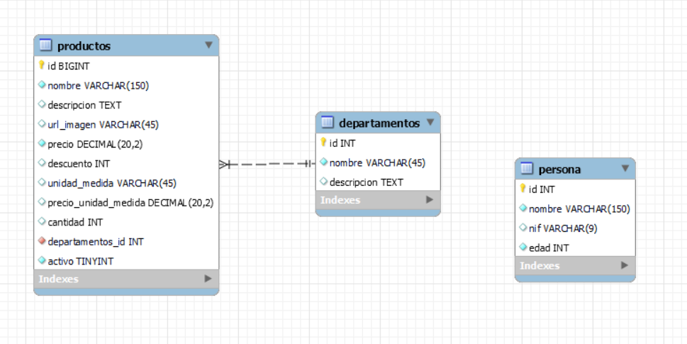

# persistencia.jdbc

Proyecto java para la capa de persistencia con JDBC.

Usamos un SGBD de MySQL y driver mysql-connector-java 5.1.46.

## Importar proyecto a eclipse

1. Clonar repositorio desde Github a Eclipse
2. Importar > Existing Maven Project

## Script bbdd

El script para crear la bbdd lo podemos encontrar en la raiz del proyecto **txurdi.sql**




## Test Junit para comprobar la conexión

com.txurdi.persistencia.jdbc.TestConnection

```
Connection con = DriverManager.getConnection("jdbc:mysql://localhost:3306/txurdi", "root", "root");
assertNotNull("La conexion no puede ser nula",con);
```


## Tabla de contenidos
* [Crud simple](#crud-simple)
* [DAO y Procedimientos Almacenados](#dao-y-procedimientos-almacenados)


### Crud Simple

**package com.txurdi.persistencia.crud.basico;**

Ejemplos básicos para realizar un CRUD contra la tabla de persona. 

Aprendermos a realizar la conexión a la bbdd y ejecurtar sentencias SELECT, INSERT, UPDATE y DELETE.


	
### DAO y Procedimientos Almacenados

**package com.txurdi.persistencia.modelo.dao;**

Ejemplos para realizar un DAO (Direct Access Object), implementando un patrón **Singleton**. 

- PersonaDAO realiza las operaciones básicas de CRUD y tiene las consultas sql escritas en Java
- ProductoDAO tiene llamadas a procedimientos almacenados en la bbdd.
